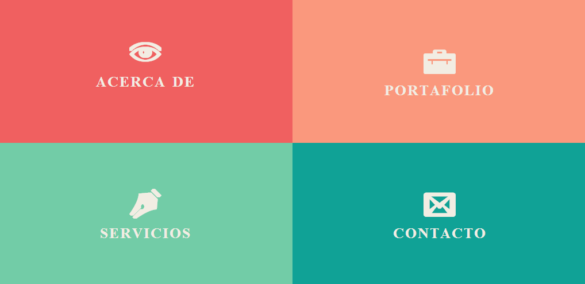
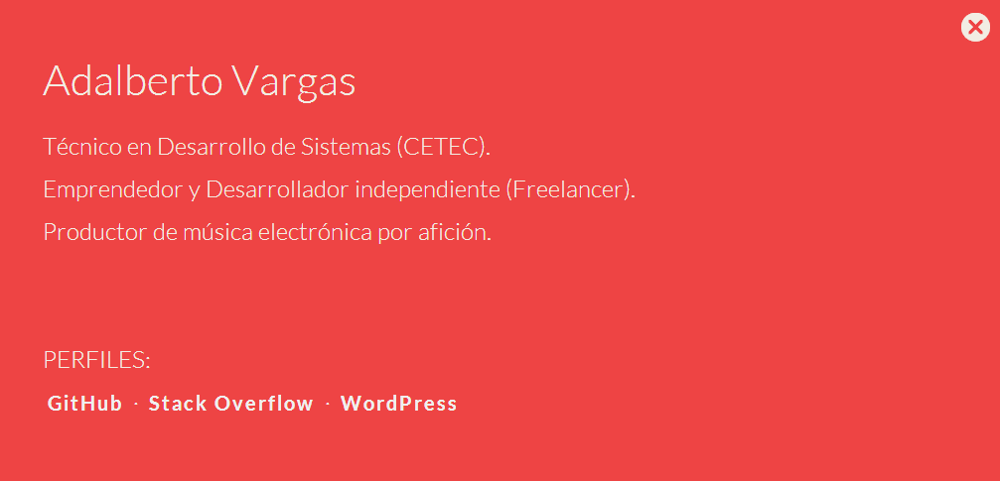
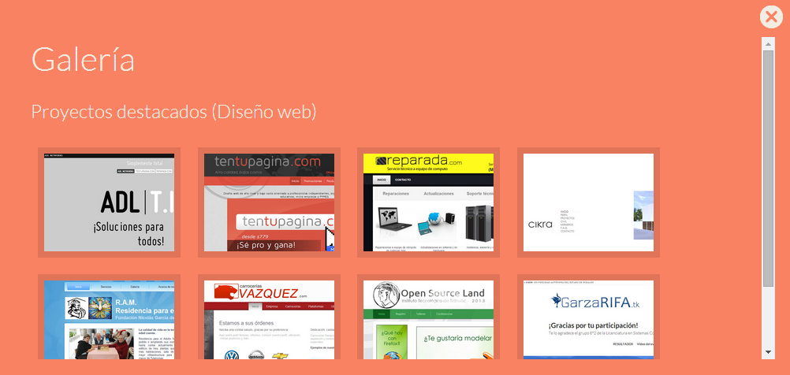

# Adalberto Vargas WS
Adalberto Vargas Website.
See it [Live.](http://www.adalbertovargas.com)


## Preview

Here there are some demo Website's screenshots


Image 1. Welcome screen



Image 2. Capture from About section



Image 3. Galery preview

You can also find these preview ScrenShots in folder `info/preview` 


## The content

Within the download you'll find the following directories (and files), logically grouping common assets. You'll see something like this:

```
├───info
│   └───preview
└───public
    ├───assets
    │   ├───css
    │   ├───fonts
    │   ├───images
    │   └───js
    ├───cloud
    └───seq         => seQ App
```

Sometimes is compiled and minified CSS and JS (`file.min.*`).

### Included projects:

- [seQ App](https://github.com/adlnetworks/seQ)

## Author

**Adalberto Vargas**

- <http://www.adalbertovargas.com/>

### Hire me

I'm available for freelance work. Remote worldwide or locally around Guadalajara, Puebla, Mexico & Monterrey. Mail me: contacto@adalbertovargas.com

#### Just For ADL

Location

Local development:
```
:/data/Codes/ADL/adalbertoVargas-ws
```
Remote vevelopment:
```
https://github.com/adalbertovargas/adalbertovargas-ws.git
```
GitHub:
```
https://github.com/adalbertovargas/adalbertovargas-ws
```
## Copyright and license

Copyright 2014 [ADL NETWORKS](https://www.adlnetworks.com), S.A.

Code Licensed under [MIT](http://www.opensource.org/licenses/mit-license.php). Totally free for private or commercial projects.