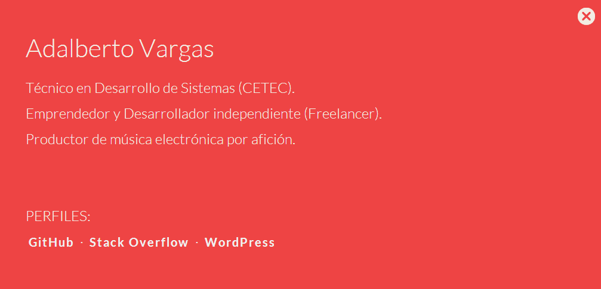
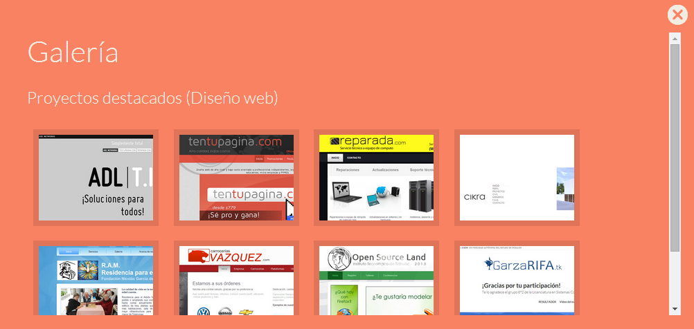

# adalbertovargas-ws
Adalberto Vargas Website


## Preview

You can also find these preview ScrenShots  `info/preview` folder




## The content

Within the download you'll find the following directories (and files), logically grouping common assets. You'll see something like this:

```
├───info
│   └───preview
└───public
    ├───assets
    │   ├───css
    │   ├───fonts
    │   ├───images
    │   └───js
    ├───cloud
    └───seq
        └───assets
            ├───app
            ├───css
            ├───fonts
            ├───img
            ├───js
            ├───plugins
            │   ├───bootswatch
            │   ├───jquery
            │   └───jquery-frame
            └───runjs
```

Sometimes is compiled and minified CSS and JS (`file.min.*`).

## Author

**Adalberto Vargas**

- <http://www.adalbertovargas.com/>

### Hire me

I'm available for freelance work. Remote worldwide or locally around Guadalajara, Puebla, Mexico & Monterrey. Mail me: contacto@adalbertovargas.com

#### Just For ADL

Location
```
Local development:
:/xampp/htdocs/1/ADL/adalbertovargas-ws

Remote vevelopment:
https://github.com/adalbertovargas/adalbertovargas-ws.git

GitHub:
https://github.com/adalbertovargas/adalbertovargas-ws
```
## Copyright and license

Copyright 2014 [ADL NETWORKS](https://www.adlnetworks.com), S.A.

Code Licensed under [MIT](http://www.opensource.org/licenses/mit-license.php). Totally free for private or commercial projects.